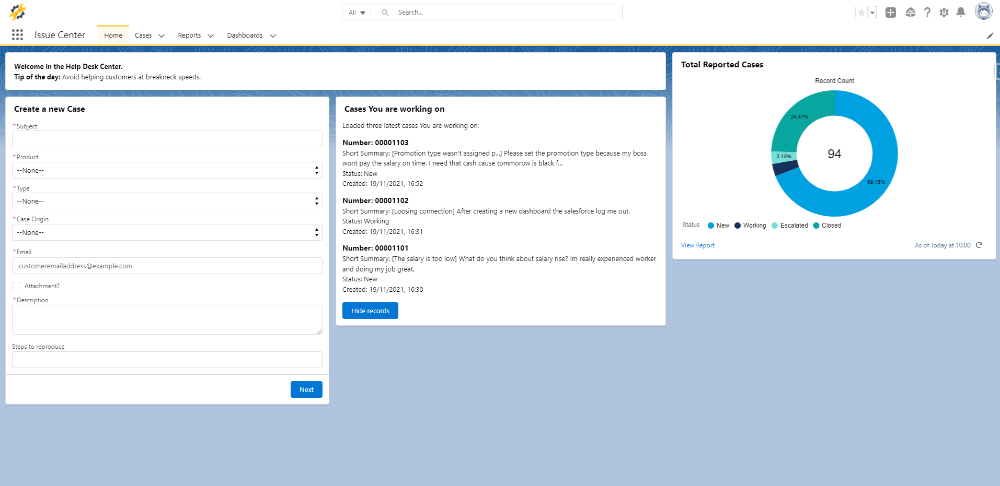

# Service Application
> Place where platform user (employee) can quickly save the problem reported by the customer.

## Table of contents
* [General info](#general-info)
* [Screenshots](#screenshots)
* [Functionalities](#functionalities)
* [Status](#status)
* [Contact](#contact)

## General info
The purpose of it is to show my skills in each scope of knowledge: aura components, flow, apex and triggers.

## Screenshot

## Functionalities
* Possibility to create in a fast way a new case straight from home page of issue center (screen flow)
* Preview of three latest cases created by viewing user (aura component, apex)
* Automatically generated short summary of case based on data entered in the form by the employee (trigger)
* Automatically creating dummy contact and account, if contact with entered email doesnt exist (trigger)
* Automatically sending notification email to customer when status case has changed (trigger flow)

## Status
Project is: _finished_

## Contact
Check out my profile on: [LinkedIn](https://www.linkedin.com/in/robert-rachwa%C5%82/), [Trailblazer.me](https://trailblazer.me/id/rrachwal).
Created by GarQet. Email: rob.rachwal@gmail.com
